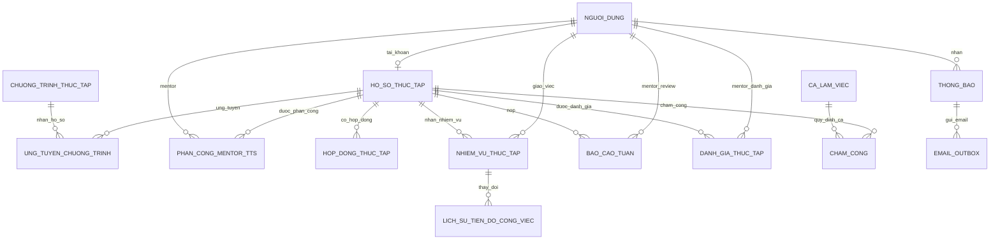

# Báo cáo nghiệm thu Sprint 1 và kế hoạch Sprint 2

**Dự án:** Hệ thống Quản lý Thực tập sinh (IMS) 
**Ngày rà soát:** 28/09/2026 
**Phạm vi:** Đối chiếu backlog, mã nguồn frontend/backend và CSDL MySQL runtime. Đây là báo cáo rà soát, không thay đổi code hay dữ liệu CSDL.

## Tóm tắt

- Có 5/7 US Sprint 1 đã triển khai luồng chính. US03 thiếu phân trang; US04 chưa bao phủ việc nộp đơn xin thực tập. Chưa đủ căn cứ nghiệm thu toàn Sprint ở mức 100%.
- Sheet Sprint 1 trong workbook vẫn ghi “Chưa làm” cho các task, khác với trạng thái mã nguồn hiện tại; PO/QA cần cập nhật sau nghiệm thu.
- MySQL runtime có 36 tài khoản, 23 hồ sơ TTS, 9 mentor, 4 chương trình và 7 đơn ứng tuyển. Tài khoản TTS và hồ sơ khớp 1:1.
- Đề xuất đúng 11 US cho Sprint 2. Priority/Estimate tổng backlog đang để trống trong workbook, nên mức ưu tiên dưới đây là đề xuất cần PO xác nhận.
- Các bảng ứng tuyển, phân công mentor, thông báo đã tồn tại. Không tạo bản sao; các bảng mới chỉ là đề xuất, chưa chạy migration.

## 1. Phương pháp và căn cứ

Đã đọc sheet Backlogs và Sprint 1; rà soát route, middleware, caller, cấu hình và schema; dùng truy vấn SELECT chỉ đọc trên MySQL runtime rồi rollback. Không thay đổi database. File SQLite cục bộ được kiểm tra riêng và không được coi là nguồn dữ liệu live.

Backlog tổng có 42 US nhưng Estimate/Priority chưa được điền. Sprint 1 liệt kê 7 US cần rà soát nhưng task status vẫn là “Chưa làm”. Team charter trong ảnh dùng làm căn cứ phân vai và nguồn lực.

“Đạt ở mức triển khai” nghĩa là luồng chính có trong mã nguồn; không đồng nghĩa đã qua UAT/E2E. Không suy ra kiểm thử thành công chỉ vì route tồn tại.

## 2. Phần 1 — Báo cáo kết quả Sprint 1

| Mã US | User Story | Kết quả rà soát | Ghi chú kiểm thử / dữ liệu |
|---|---|---|---|
| US39 | Tạo tài khoản và đăng nhập | **Đạt ở mức triển khai; chưa xác nhận UAT 100%** | Có đăng ký/đăng nhập, mật khẩu băm, session theo tài khoản, middleware API và tái kiểm tra WebSocket. Single-device không khóa theo riêng Admin. Chưa chạy E2E hai thiết bị cho từng vai trò; tại thời điểm kiểm tra có 1 session hoạt động. |
| US01 | Thêm hồ sơ thực tập sinh | **Đạt ở mức triển khai** | Có form và API tạo hồ sơ; MySQL có 23 hồ sơ. Cần QA xác nhận thao tác tạo và dữ liệu sau lưu. |
| US02 | Cập nhật/chỉnh sửa hồ sơ | **Đạt ở mức triển khai** | Có form sửa và API cập nhật theo hồ sơ. Chưa có bằng chứng kiểm thử hồi quy CRUD đầu-cuối trong lượt rà soát. |
| US03 | Tìm kiếm và lọc danh sách TTS | **Cần hoàn thiện** | Search/filter theo trạng thái, phòng ban, trường có mặt; chưa có pagination page/limit/offset như backlog yêu cầu. |
| US29 | Thêm Mentor | **Đạt ở mức triển khai** | Có form/API và KPI mentor; MySQL có 9 hồ sơ mentor. Cần QA xác nhận KPI cập nhật sau khi thêm mới. |
| US11 | Tạo chương trình thực tập | **Đạt ở mức triển khai** | Có CRUD chương trình và luồng nhận hồ sơ. MySQL có 4 chương trình, tổng chỉ tiêu 27; cả 4 đang mở tại thời điểm truy vấn. |
| US04 | Upload CV/đơn xin thực tập | **Cần hoàn thiện phạm vi** | Upload giới hạn 15 MB, PDF/DOCX/PNG. TTS chỉ tự upload CV, chưa có luồng nộp đơn xin thực tập; bảng tài liệu hiện có 0 bản ghi nên chưa xác nhận upload live. |

### Các điểm Sprint 1 còn thiếu hoặc chưa được xác minh — cần PO chọn phương án

Các mục dưới đây phân biệt **thiếu chức năng** với **chưa có bằng chứng kiểm thử**. Việc chưa test không khẳng định tính năng bị lỗi, nhưng chưa đủ cơ sở để nghiệm thu.

| Mức | US / hạng mục | Hiện trạng cụ thể và tác động | Phương án để xem xét |
|---|---|---|---|
| Chặn nghiệm thu | **US03 — phân trang** | Có tìm kiếm và lọc, nhưng request/danh sách hiện chưa có page, page size, offset và tổng số trang. Khi danh sách tăng, tải quá nhiều hàng, khó chuyển trang và khó giữ điều kiện lọc nhất quán. | **A (đề xuất):** bổ sung phân trang server-side, giữ nguyên từ khóa/bộ lọc khi chuyển trang, trả total count và có chọn số dòng/trang. **B:** nếu chưa cần phân trang, PO sửa phạm vi US03 và nghiệm thu rõ giới hạn danh sách; không đánh dấu đủ tiêu chí backlog hiện tại. |
| Chặn nghiệm thu phạm vi | **US04 — đơn xin thực tập** | Luồng TTS hiện chỉ cho tự nộp loại CV; dù schema có loại tài liệu đơn xin thực tập, chưa thấy luồng TTS gửi loại đó. Bảng tài liệu MySQL có 0 dòng nên chưa xác nhận upload thành công trên runtime. | **A (đề xuất):** cho TTS nộp CV và đơn xin thực tập, phân biệt loại tài liệu, cho xem/tải lại và kiểm quyền. **B:** xác nhận nghiệp vụ chỉ cần CV và cập nhật lại tên/mô tả US04; quyết định cần dựa trên backlog/PO. Sau đó QA thử file hợp lệ, sai định dạng, quá 15 MB, tải lại và quyền truy cập. |
| Chưa đủ bằng chứng bảo mật | **US39 — Single Device Session** | Mã nguồn có session theo người dùng, middleware API và kiểm tra WebSocket; chưa chạy thử đăng nhập cùng tài khoản ở hai trình duyệt cho đủ Admin, Quản lý, Mentor, TTS. Vì vậy chưa xác nhận thiết bị cũ bị đẩy ra ở mọi vai trò và API cũ trả 401. | **A (đề xuất):** QA chạy ma trận 4 vai trò × 2 trình duyệt; sau lần đăng nhập thứ hai, kiểm tra chuyển về login/thông báo, API của phiên cũ trả 401, socket đóng hoặc phát sự kiện hết hạn. Nếu có vai trò không đạt thì sửa middleware/socket rồi chạy lại ma trận. |
| Chưa đủ bằng chứng chức năng | **US01/US02/US29/US11 — CRUD** | Các form/API chính có trong code, nhưng rà soát này chưa chạy thao tác đầu-cuối với dữ liệu thử để chứng minh tạo/sửa, cập nhật danh sách/KPI và xử lý lỗi. | **A (đề xuất):** QA chạy create → reload/list → detail → update → xác nhận dữ liệu, kiểm tra quyền và input không hợp lệ trên môi trường test; lưu kết quả theo US. Không cần coi số lượng bản ghi hiện có là bằng chứng cho từng thao tác. |
| Chưa đủ bằng chứng giao diện | **Light/Dark và responsive** | Theme lưu trong localStorage; lint/build đạt nhưng chưa kiểm tra bằng mắt các trang, modal, dropdown, badge, bảng rộng và scrollbar trên nhiều kích thước màn hình. Lint/build không bắt được lỗi tương phản hoặc cắt chữ. | **A (đề xuất):** kiểm tra thủ công các trang TTS, Mentor, Chương trình, Tài liệu ở cả hai theme, màn hình desktop và hẹp; chụp/ghi lỗi tương phản, tràn bảng, font/cắt nội dung rồi sửa trước nghiệm thu. |
| Thiếu lớp kiểm thử tự động | **Backend/API toàn Sprint** | Không tìm thấy backend test suite; mới có kết quả compile code. Compile không gọi API, không kiểm quyền, CSDL, upload hay chuyển trạng thái. | **A (đề xuất):** bổ sung test tập trung cho phân trang, upload, CRUD, single-session và quyền truy cập; dùng DB test riêng, không chạy test ghi/xóa trên MySQL đang dùng. Nếu chưa kịp, ghi rõ đây là rủi ro chấp nhận có chủ sở hữu và kế hoạch bù test. |
| Rủi ro tái lập môi trường | **MySQL / SQLite** | Cấu hình runtime hiện chọn MySQL, trong khi hướng dẫn dự án/một ghi chú migration nói SQLite; file SQLite local có số liệu khác (22 tài khoản, 16 hồ sơ, không có chương trình/mentor/tài liệu). Người chạy nhầm DB có thể thấy dữ liệu khác và tưởng API/dashboard lỗi. | **A (đề xuất):** PO/tech lead xác nhận MySQL là nguồn chuẩn, cập nhật hướng dẫn chạy/migration và ghi rõ SQLite chỉ là snapshot/test. **B:** nếu SQLite vẫn được hỗ trợ, bổ sung quy trình seed/migration và test tương đương cho hai backend. Không xóa hay đồng bộ dữ liệu giữa hai DB khi chưa có quyết định. |
| Sai lệch quản lý backlog | **Sheet Sprint 1** | Workbook vẫn ghi các task là “Chưa làm”, trong khi code có nhiều luồng đã triển khai. Trạng thái này không phản ánh tiến độ thật và làm báo cáo sprint thiếu tin cậy. | PO/SM đối chiếu từng acceptance criteria với kết quả QA, rồi cập nhật trạng thái task thành Done/Doing/Not Done cùng liên kết bằng chứng; không đổi trạng thái chỉ dựa trên việc thấy route trong code. |

**Đề xuất cách chốt:** trước tiên PO quyết định phạm vi US04 (có bắt buộc nộp đơn xin thực tập không) và xác nhận phân trang vẫn nằm trong US03. Sau đó QA chạy ma trận US39 và checklist CRUD/UI; các kết quả chưa chạy phải tiếp tục để trạng thái “chưa xác minh”, không gộp thành lỗi đã tái hiện.

### Đánh giá chất lượng

| Hạng mục | Kết quả và giới hạn |
|---|---|
| Backend/API | Có luồng chính cho tài khoản, hồ sơ, mentor, chương trình, tài liệu, session. Compile thành công; không tìm thấy backend test suite được cấu hình. |
| CSDL | Runtime chọn MySQL. Có 36 tài khoản: 2 Admin, 2 HR/Quản lý, 9 Mentor, 23 TTS. 23 hồ sơ TTS khớp tài khoản TTS 1:1. SQLite snapshot cục bộ khác MySQL. |
| Chương trình/ứng tuyển | 4 chương trình, chỉ tiêu tổng 27; 7 ứng tuyển, gồm 6 chờ xử lý và 1 được chấp nhận. |
| Phân công Mentor | 11 phân công trên 11 hồ sơ; 7 mentor có TTS được phân công; không phát hiện khóa ngoại mồ côi trong kiểm tra. |
| Light/Dark UI | Có lưu lựa chọn theme bằng localStorage; các trang quản lý có dropdown và scrollbar tùy chỉnh. Rà soát ở mức mã nguồn, chưa kiểm tra trực quan trên ma trận trình duyệt/độ phân giải. |
| Single Device Session | Middleware áp dụng cho API được bảo vệ, WebSocket tái xác thực định kỳ. Chưa test song song từng vai trò. Chức năng đăng ký có sẵn ngoài US39 được giữ nguyên theo yêu cầu. |
| Rủi ro nghiệm thu | US03 thiếu phân trang, US04 thiếu đơn xin thực tập; cần khép hai khoảng trống và kiểm thử với dữ liệu lớn hơn. |

### Kiểm tra đã chạy

- Tại frontend: npm run lint — thành công.
- Tại frontend: npm run build — thành công.
- Tại backend: .\.venv\Scripts\python.exe -m compileall -q app — thành công (chạy từ thư mục backend).
- Không tìm thấy bộ backend test được cấu hình; chưa có kết quả unit/integration test.
- Chưa chạy kiểm thử UI thủ công hoặc E2E trong lượt rà soát.

**Lưu ý nền tảng:** hướng dẫn dự án nêu FastAPI + SQLite, nhưng cấu hình runtime hiện chọn MySQL; một ghi chú migration cũng nói SQLite. Cần đồng bộ tài liệu với cách chạy thực tế. Báo cáo dùng MySQL cho số liệu live và giữ nguyên cả hai CSDL.

## 3. Phần 2 — Kế hoạch Sprint 2 (đề xuất 2 tuần / 10 ngày làm việc)

Chọn 11 US chưa thấy luồng hoàn chỉnh, theo phụ thuộc nghiệp vụ. Priority “Cao” và estimate là đề xuất, không phải giá trị trong workbook.

| US | User Story | Frontend UI | Backend API | MySQL (đề xuất) | Tiêu chí nghiệm thu | Phụ trách chính / ước lượng |
|---|---|---|---|---|---|---|
| US08 | Gửi email kết quả xét duyệt | Hiển thị trạng thái gửi/lỗi, thông báo trong ứng dụng | Phát sự kiện duyệt/từ chối; gửi bất đồng bộ, retry, chống gửi trùng, lưu lỗi | Tái dùng thong_bao; thêm email_outbox (người nhận, template/key, trạng thái, lần thử, lỗi, thời gian) | Duyệt/từ chối tạo đúng một thông báo; lỗi SMTP không làm thất bại thao tác duyệt; retry truy vết được | FE Nguyễn Văn Vũ; BE Nguyễn Thị Hồng Vân; QA Vũ Đức Đạt — 3 ngày |
| US09 | Tải hợp đồng thực tập | Form tải, xem/tải lại và trạng thái hợp đồng | Upload an toàn, RBAC, kiểm loại/kích thước, gắn với hồ sơ/kỳ | hop_dong_thuc_tap (hồ sơ, kỳ, URL, trạng thái, người tải, thời gian) | Đúng quyền mới tải/xem; từ chối tệp sai; không lộ đường dẫn nội bộ | FE Nguyễn Quốc Việt; BE Nguyễn Thành Đạt; QA Vũ Đức Đạt — 3 ngày |
| US10 | TTS xác nhận hợp đồng | Trang chi tiết, xác nhận/từ chối, lịch sử | Xác minh chủ hồ sơ, trạng thái hợp lệ, ghi thời gian/người xác nhận, chống lặp | Bổ sung trạng thái, người/thời điểm xác nhận, lý do từ chối vào hop_dong_thuc_tap | TTS chỉ xử lý hợp đồng của mình; thao tác lặp không tạo trạng thái sai; tải lại vẫn thấy kết quả | FE Hoàng Đình Gia Đạt; BE Hoàng Tiến Đạt; QA Vũ Đức Đạt — 2 ngày |
| US14 | Xem lịch thực tập cá nhân | Lịch/agenda theo tuần, kỳ, chương trình và mentor | Trả lịch theo danh tính từ token, ghép chương trình/phân công, xử lý timezone | Tái dùng ngày chương trình và phan_cong_mentor_tts; không cần bảng mới | TTS chỉ xem lịch của mình; timezone nhất quán; trạng thái rỗng rõ ràng | FE Nguyễn Văn Vũ; BE Nguyễn Hải Đăng; QA Vũ Đức Đạt — 2 ngày |
| US15 | Mentor giao nhiệm vụ cho TTS | Danh sách, chi tiết, form giao việc/hạn/ưu tiên | Tạo/sửa/giao nhiệm vụ; xác minh quan hệ Mentor–TTS | nhiem_vu_thuc_tap (hồ sơ, mentor, nội dung, hạn, ưu tiên, trạng thái) | Chỉ mentor phụ trách mới giao; TTS nhận đúng nhiệm vụ; validate trường bắt buộc/hạn | FE Nguyễn Quốc Việt; BE Nguyễn Thành Đạt; QA Vũ Đức Đạt — 3 ngày |
| US16 | TTS cập nhật tiến độ nhiệm vụ | Cập nhật trạng thái/phần trăm/ghi chú, xem lịch sử | Chỉ chủ nhiệm vụ được cập nhật; validate và lưu lịch sử thay đổi | Mở rộng nhiem_vu_thuc_tap; thêm lich_su_tien_do_cong_viec | Không sửa nhiệm vụ người khác; tiến độ hợp lệ; mentor thấy lịch sử và trạng thái mới | FE Hoàng Đình Gia Đạt; BE Ngô Tiến Đạt; QA Vũ Đức Đạt — 2 ngày |
| US17 | TTS nộp báo cáo tuần | Form báo cáo theo tuần, nội dung/kết quả/vướng mắc | Tạo/sửa nháp/nộp; áp dụng quy tắc khóa sửa sau nộp do PO chốt | bao_cao_tuan (hồ sơ, tuần/kỳ, nội dung, trạng thái, tệp, thời điểm nộp) | Không trùng báo cáo cùng tuần/kỳ; mentor xem được báo cáo đã nộp; kiểm quyền/field | FE Nguyễn Văn Vũ; BE Nguyễn Thị Hồng Vân; QA Vũ Đức Đạt — 3 ngày |
| US18 | Mentor review và phản hồi báo cáo | Hàng đợi báo cáo, chi tiết, nhận xét, lọc trạng thái | Danh sách theo mentor được giao; nhận xét/yêu cầu bổ sung; lưu reviewer/thời gian | Bổ sung trạng thái review, nhận xét, reviewer, thời điểm vào bao_cao_tuan | Mentor chỉ review TTS được phân công; TTS thấy phản hồi; có dấu vết người/thời gian | FE Nguyễn Quốc Việt; BE Nguyễn Hải Đăng; QA Vũ Đức Đạt — 2 ngày |
| US19 | Mentor đánh giá kỹ năng/thái độ | Form điểm/tiêu chí, nhận xét và lịch sử | Tạo/sửa đánh giá; xác minh quan hệ; tránh trùng theo kỳ | danh_gia_thuc_tap (hồ sơ, mentor, kỳ, điểm, nhận xét, thời gian) | Thang điểm được PO chốt; chỉ mentor phụ trách đánh giá; quyền xem đúng vai trò | FE Hoàng Đình Gia Đạt; BE Ngô Tiến Đạt; QA Vũ Đức Đạt — 2 ngày |
| US21 | TTS chấm công vào/ra | Chấm công hôm nay và lịch sử | Check-in/out idempotent; danh tính từ token; kiểm ca và chống trùng | cham_cong (hồ sơ, ca, ngày, giờ vào/ra, trạng thái, ghi chú) | Không chấm công hộ; mỗi ca/ngày có bản ghi hợp lệ; gửi lại không tạo trùng; thời gian từ máy chủ | FE Nguyễn Quốc Việt; BE Nguyễn Thành Đạt; QA Vũ Đức Đạt — 3 ngày |
| US23 | Quản lý cấu hình ca làm linh hoạt | CRUD ca, giờ bắt đầu/kết thúc, ngày áp dụng/nghỉ | CRUD có RBAC; kiểm tra giờ, chồng lấn và phạm vi; cung cấp dữ liệu cho lịch/chấm công | ca_lam_viec (tên, giờ, ngày, hiệu lực, phòng ban/phạm vi, trạng thái) | Chỉ Quản lý cấu hình; từ chối ca sai/chồng lấn theo chính sách; lịch/chấm công dùng cấu hình mới | FE Nguyễn Văn Vũ; BE Hoàng Tiến Đạt; QA Vũ Đức Đạt — 3 ngày |

### Phân công theo team charter

- **Product Owner:** Nguyễn Khánh Tùng — chốt ưu tiên, quy tắc và nghiệm thu; nguồn lực 10 giờ/tuần.
- **Scrum Master/Leader:** Hoàng Tiến Đạt — điều phối, tháo gỡ phụ thuộc, review kiến trúc; 40 giờ/tuần.
- **Frontend:** Nguyễn Văn Vũ, Nguyễn Quốc Việt, Hoàng Đình Gia Đạt — chia đầu việc FE theo bảng.
- **Backend:** Nguyễn Thành Đạt, Hoàng Tiến Đạt, Ngô Tiến Đạt, Nguyễn Hải Đăng, Nguyễn Thị Hồng Vân — API/schema/bảo mật; 40 giờ/tuần mỗi thành viên theo charter.
- **QA:** Vũ Đức Đạt — test chức năng UI/API, phân quyền và hồi quy cả 11 US; 40 giờ/tuần.
- Người trong bảng là đầu mối chính; các nhóm phối hợp theo phụ thuộc.

### Timeline dự kiến

| Mốc | Công việc |
|---|---|
| Trước sprint / ngày 1 | PO chốt ưu tiên, email, hợp đồng, thang điểm, ca/timezone; thống nhất API contract, RBAC và migration additive. |
| Ngày 1–2 | FE/BE dựng nền hợp đồng, email outbox, ca, nhiệm vụ, báo cáo; QA chuẩn bị test case/dữ liệu; review schema. |
| Ngày 3–5 | Hoàn thành slice US08–US10, US14–US16, US23; tích hợp từng phần, kiểm API/quyền; demo giữa sprint ngày 5. |
| Ngày 6–8 | Hoàn thành US17–US19, US21; nối báo cáo–review–đánh giá và ca–chấm công; hồi quy. |
| Ngày 9 | Sửa lỗi; kiểm quyền sở hữu dữ liệu, retry email, dữ liệu biên và migration trên môi trường test. |
| Ngày 10 | UAT với PO, nghiệm thu DoD, cập nhật backlog và ghi nhận phần chưa đạt. Không áp dụng migration production trong kế hoạch này. |

### Definition of Done

1. PO chấp thuận nghiệp vụ; giao diện có trạng thái tải, rỗng, lỗi và thành công.
2. API xác thực danh tính/quyền từ server, validate đầu vào; không tin role do client gửi.
3. Migration additive có FK/index/ràng buộc và hướng dẫn rollback; chạy ở DB test, không sửa trực tiếp DB đang dùng.
4. Có kiểm thử UI/API cho luồng chính, quyền sai, dữ liệu biên và gửi lặp; ghi lại kết quả thật.
5. Frontend lint/build và backend compile/test đạt; QA/PO xác nhận acceptance criteria, không còn lỗi chặn.

**Phụ thuộc:** US10 sau US09; US16 sau US15; US18 sau US17; US21 cần chính sách ca US23; US14 dùng lịch chương trình/phân công sẵn có. US20 (báo cáo tổng kết cuối kỳ) đề xuất để Sprint 3 sau khi có dữ liệu nhiệm vụ, báo cáo tuần và đánh giá. PO cần chốt provider SMTP, quy tắc hợp đồng, timezone/ngày nghỉ, thang điểm và quyền xem nhận xét.

## 4. Phần 3 — Sơ đồ kết nối CSDL MySQL Sprint 2

### Bảng hiện hữu và bảng dự kiến

| Thực thể yêu cầu | Bảng tương ứng | Quyết định |
|---|---|---|
| applications | ung_tuyen_chuong_trinh | Đã có 7 dòng; tái sử dụng, không tạo bảng trùng. |
| mentor_assignments | phan_cong_mentor_tts | Đã có 11 dòng; tái sử dụng, không tạo bảng trùng. |
| notifications | thong_bao | Đã có 11 dòng; tái sử dụng cho in-app. Schema có kênh App/Email nhưng chưa có bằng chứng email được gửi thực tế. |
| email delivery queue | email_outbox | Đề xuất mới cho US08: retry, chống gửi trùng, trạng thái/lỗi gửi. |
| evaluations | danh_gia_thuc_tap | Đề xuất mới cho US19; chưa có bảng đánh giá hiện tại. |
| contracts | hop_dong_thuc_tap | Đề xuất mới cho US09–US10. |
| tasks/progress | nhiem_vu_thuc_tap, lich_su_tien_do_cong_viec | Đề xuất mới cho US15–US16. |
| weekly reports | bao_cao_tuan | Đề xuất mới cho US17–US18. |
| schedules/attendance | ca_lam_viec, cham_cong | Đề xuất mới cho US23/US21. US14 tái dùng ngày chương trình và phân công. |

### Sơ đồ quan hệ logic

Tên sơ đồ là tên logic; khi triển khai phải dùng tên vật lý hiện có cho các bảng đã tồn tại. Thiết kế migration cần chốt FK, index, quy tắc xóa và unique key; dự kiến unique cho chấm công theo hồ sơ–ca–ngày, báo cáo theo hồ sơ–tuần–kỳ, đánh giá theo hồ sơ–mentor–kỳ. Không chạy DDL trong lượt rà soát.

## 5. Việc cần chốt trước Sprint Planning

1. PO xác nhận 11 US và thứ tự ưu tiên; backlog tổng chưa điền estimate/priority.
2. Chọn SMTP/provider, nội dung email, retry và thời hạn lưu outbox.
3. Chốt loại hợp đồng, thao tác xác nhận/từ chối và quyền truy cập file.
4. Chốt ca, timezone, ngày nghỉ, grace period và chính sách sửa công.
5. Chốt tiêu chí/thang điểm, kỳ đánh giá và quyền xem nhận xét.
6. Đồng bộ tài liệu SQLite/MySQL với runtime và hướng dẫn khởi tạo; không coi SQLite cục bộ là dữ liệu live.

## Nguồn đối chiếu

- Workbook: sheet Backlogs (42 US; estimate/priority trống) và Sprint 1 (7 US, task status “Chưa làm”).
- Mã nguồn backend/frontend và schema MySQL runtime tại ngày rà soát.
- Team charter trong ảnh đính kèm; phân vai và nguồn lực theo vai trò ghi trong charter.
